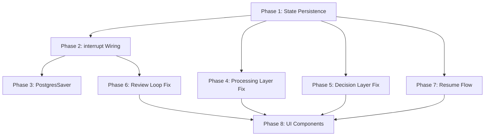
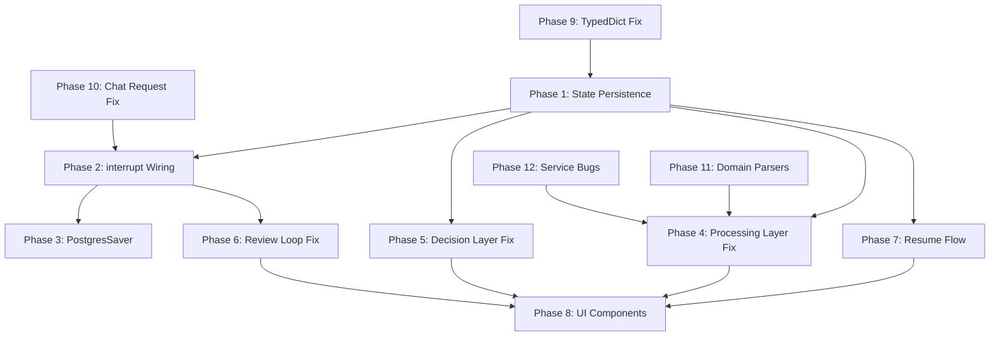

## Plan: Complete Agent-to-UI Wiring for 7-Phase Flow

### Problem Summary

The orchestrator graph and UI are structurally present but not correctly wired for the spec's 7-phase interactive flow. The graph runs to completion in a single `ainvoke()` instead of pausing at phase boundaries via `interrupt()`. State is lost between chat turns. Processing/decision nodes violate layer rules. Several UI components are stubs.

**Additional issues found by exploration subagents:**
- `ApplicantState` extends `dict` instead of `TypedDict`, which breaks the `add_messages` reducer annotation
- Domain parsers return hardcoded "Demo Applicant" data instead of actually parsing inputs (real parsing exists in `infrastructure/document_processing/` and `domain/parsers/llm_extraction.py` but isn't wired through)
- `ExtractionService.__init__` never initializes `self.pdf_parser`, `self.ocr_engine`, `self.xlsx_extractor`, `self.resume_parser` -- `extract_document()` will raise `AttributeError`
- `DecisionService.make_decision()` uses `datetime.now(timezone.utc)` without importing `datetime`/`timezone`
- UI sends multipart form data (files + text) but `ChatRequest` schema expects JSON with `file_paths: list[str]` -- request format mismatch
- Embedding creation uses SHA-256 pseudo-vectors instead of real Ollama embeddings
- Two confidence scoring systems exist with different thresholds
- 8 schema/constant/exception files are empty stubs

---

### Phase 1: State Persistence Between Chat Turns

**Files**: `src/api/v1/chat.py`, `src/services/agent_runner.py`, `src/infrastructure/db/repositories/application_repo.py`

Currently each chat call invokes the graph with only `messages`, `current_phase`, `applicant_id`, `application_id`, `uploaded_files`. All accumulated state (applicant_info, uploaded_documents, extraction_results, discrepancies, etc.) is lost.

**Changes**:
- Store the full `ApplicantState` JSON in the `applications` table (add a `state_snapshot` JSONB column)
- On each chat request, load the state snapshot from DB, merge new user input, invoke graph, save updated snapshot
- `agent_runner.run()` accepts full state dict, not just the 5 fields
- `chat.py` loads state from `ApplicationRepository.get_state(application_id)` before invoking the graph

---

### Phase 2: interrupt() Wiring for Phase Boundaries

**Files**: `src/agents/orchestrator/phases/intake.py`, `src/agents/orchestrator/phases/document_collection.py`, `src/agents/orchestrator/phases/review.py`, `src/agents/orchestrator/phases/enablement.py`, `src/services/agent_runner.py`, `src/api/v1/chat.py`, `ui/fragments/chat_area.py`

The spec requires the graph to pause at phase boundaries using `interrupt()` and resume with `Command(resume=...)`. Currently the graph runs to completion in one shot.

**Changes**:
- Add `interrupt()` calls in `intake_node` (when missing fields), `document_collection_node` (when missing docs), `review_node` (when unresolved discrepancies), `enablement_node` (for follow-up questions)
- `agent_runner.run()` returns interrupt data when graph pauses
- `chat.py` detects `__interrupt__` in result, returns interrupt context in `ChatResponse`
- `chat_area.py` renders interrupt questions as assistant messages
- On next user submission, `agent_runner.run()` uses `Command(resume=user_input)` instead of fresh `ainvoke()`
- Store the `thread_id` and checkpoint state so resume works across HTTP requests

---

### Phase 3: Migrate to PostgresSaver Checkpointer

**Files**: `src/agents/orchestrator/graph.py`, `src/agents/validation/graph.py`, `src/infrastructure/db/session.py`

Currently using `SqliteSaver` with local files. The spec requires `PostgresSaver` for production persistence and resume capability.

**Changes**:
- Replace `SqliteSaver.from_conn_string("orchestrator.db")` with `PostgresSaver.from_conn_string(DATABASE_URL)` in orchestrator graph
- Replace `SqliteSaver(conn)` in validation graph with `PostgresSaver`
- Remove SQLite checkpoint files
- Ensure `PostgresSaver` table is created via Alembic migration or `setup()` call

---

### Phase 4: Fix Processing Node Layer Violations

**Files**: `src/agents/orchestrator/phases/processing.py`, `src/services/extraction_pipeline.py` (new or extend existing)

The processing node directly opens DB sessions, creates repositories, and persists to PostgreSQL/Qdrant/Neo4j. This violates the 4-layer architecture (nodes should only invoke subgraphs and produce state updates).

**Changes**:
- Extract all DB/Qdrant/Neo4j persistence from `processing_node` into `ExtractionPipeline.persist_results(state)` in the services layer
- `processing_node` only invokes extraction subgraph, validation subgraph, and returns state updates
- The `agent_runner` or a service wrapper calls `ExtractionPipeline.persist_results()` after graph invocation
- Same pattern for decision node DB writes

---

### Phase 5: Fix Decision Node Layer Violations

**Files**: `src/agents/orchestrator/phases/decision.py`, `src/services/decision_service.py`

Decision node directly opens DB sessions and writes to PostgreSQL.

**Changes**:
- Extract DB persistence from `decision_node` into `DecisionService.persist_decision()`
- `decision_node` only invokes eligibility/decision subgraphs and returns state updates
- `agent_runner` or service wrapper calls `DecisionService.persist_decision()` after graph completes decision phase

---

### Phase 6: Fix Review Phase Discrepancy Resolution Loop

**Files**: `src/agents/orchestrator/phases/review.py`

The review node generates clarification questions but never updates discrepancy resolution status when the user responds. It stays stuck in "review" because `discrepancies` list never shrinks.

**Changes**:
- When user responds to a clarification question (via `interrupt()` resume), update the discrepancy's `resolution_status` to "resolved" or "applicant_clarified"
- Track which discrepancies have been addressed in state
- Only transition to "decision" when all discrepancies are resolved or flagged

---

### Phase 7: Returning Applicant Resume Flow

**Files**: `src/api/v1/auth.py`, `src/services/agent_runner.py`

The auth API creates a new application for returning applicants but doesn't load LangGraph checkpoint state. The spec requires returning applicants to resume from where they left off.

**Changes**:
- `auth.py` returns the application's `current_phase` and `state_snapshot` for returning applicants
- `landing.py` passes this to the chat page so the conversation resumes from the correct phase
- The chat page initializes `st.session_state.messages` from the state snapshot if returning

---

### Phase 8: Complete UI Components

**Files**: `ui/components/enablement_section.py`, `ui/components/document_status.py`, `ui/components/phase_tracker.py`

- `enablement_section.py`: Implement rendering of expandable recommendation items from `enablement_recommendations` state
- `document_status.py`: Make `REQUIRED_DOCS` dynamic based on `support_category` from session state (match the spec's per-category requirements)
- `phase_tracker.py`: Add "authentication" as Phase 0 in the `PHASES` list (currently starts at "intake")

---

### Dependency Order

Phases 1-3 are the critical path (without state persistence and interrupt wiring, the flow cannot work). Phases 4-5 are architecture compliance. Phases 6-8 are functional completeness.

---

### Key Files Modified

| File | Change |
|------|--------|
| `src/agents/state.py` | Add `state_snapshot` support fields |
| `src/agents/orchestrator/graph.py` | PostgresSaver, interrupt-aware compilation |
| `src/agents/orchestrator/phases/intake.py` | Add `interrupt()` for missing fields |
| `src/agents/orchestrator/phases/document_collection.py` | Add `interrupt()` for missing docs |
| `src/agents/orchestrator/phases/review.py` | Add `interrupt()` for discrepancies, fix resolution tracking |
| `src/agents/orchestrator/phases/enablement.py` | Add `interrupt()` for follow-up questions |
| `src/agents/orchestrator/phases/processing.py` | Remove DB/Qdrant/Neo4j persistence |
| `src/agents/orchestrator/phases/decision.py` | Remove DB persistence |
| `src/agents/validation/graph.py` | PostgresSaver |
| `src/services/agent_runner.py` | Full state load/save, interrupt/resume support |
| `src/api/v1/chat.py` | Pass full state, handle interrupt responses |
| `src/api/v1/auth.py` | Return state snapshot for returning applicants |
| `src/domain/schemas/chat.py` | Add interrupt fields to ChatResponse |
| `ui/fragments/chat_area.py` | Handle interrupt rendering and resume |
| `ui/app_pages/landing.py` | Pass state for returning applicants |
| `ui/components/enablement_section.py` | Implement rendering |
| `ui/components/document_status.py` | Dynamic required docs per category |
| `ui/components/phase_tracker.py` | Add authentication phase |
| `src/agents/state.py` | Fix TypedDict base class |
| `src/api/v1/chat.py` | Accept multipart form data for file uploads |
| `src/domain/schemas/chat.py` | Update ChatRequest for multipart |
| `src/domain/parsers/*.py` | Wire to real extraction instead of demo data |
| `src/services/extraction_service.py` | Fix missing parser attributes |
| `src/services/decision_service.py` | Fix missing datetime import |

---

### Phase 9: Fix ApplicantState TypedDict

**Files**: `src/agents/state.py`

`ApplicantState` extends `dict` instead of `TypedDict`. The `Annotated[list[dict[str, Any]], add_messages]` annotation on `messages` only works with `TypedDict` -- using a plain `dict` subclass means LangGraph ignores the reducer and overwrites messages instead of appending.

**Changes**:
- Change `class ApplicantState(dict)` to `class ApplicantState(TypedDict)`
- Ensure all fields have proper type annotations compatible with TypedDict
- All nodes that return `ApplicantState` updates must return plain dicts (which they already do)

---

### Phase 10: Fix Chat Request Format Mismatch

**Files**: `src/api/v1/chat.py`, `src/domain/schemas/chat.py`, `ui/fragments/chat_area.py`

The UI sends multipart form data (files + text) via `_call_chat_api()`, but the `ChatRequest` Pydantic model expects JSON with `file_paths: list[str]`. The chat endpoint won't receive uploaded files correctly.

**Changes**:
- Change the chat endpoint to accept `multipart/form-data` with `text` field and `files` field
- Update `ChatRequest` or create a separate `ChatUploadRequest` that handles file uploads
- `chat_area.py` already sends multipart correctly -- just need the API to match
- Save uploaded files to disk, then pass `file_paths` to the orchestrator state

---

### Phase 11: Wire Domain Parsers to Real Extraction

**Files**: `src/domain/parsers/emirates_id.py`, `src/domain/parsers/bank_statement.py`, `src/domain/parsers/credit_report.py`, `src/domain/parsers/resume.py`, `src/domain/parsers/assets_liabilities.py`, `src/domain/parsers/application_form.py`, `src/domain/parsers/llm_extraction.py`

Domain parsers return hardcoded "Demo Applicant" data. The real parsing logic exists in `infrastructure/document_processing/` (regex-based) and `domain/parsers/llm_extraction.py` (LLM-based), but the per-type parsers don't delegate to either.

**Changes**:
- Each per-type parser should call the infrastructure extraction functions or `llm_extraction.py` as fallback
- Remove hardcoded demo data returns
- Ensure parsers accept file_path and return structured data matching the schema spec

---

### Phase 12: Fix Service Layer Bugs

**Files**: `src/services/extraction_service.py`, `src/services/decision_service.py`

- `ExtractionService.__init__` never initializes `self.pdf_parser`, `self.ocr_engine`, `self.xlsx_extractor`, `self.resume_parser` -- `extract_document()` will raise `AttributeError`
- `DecisionService.make_decision()` uses `datetime.now(timezone.utc)` without importing `datetime`/`timezone`

**Changes**:
- Initialize all parser/engine attributes in `ExtractionService.__init__` or make them lazy properties
- Add `from datetime import datetime, timezone` to `decision_service.py`

---

### Updated Dependency Order

**Execution priority**: Phase 9 (TypedDict) and Phase 12 (service bugs) are blocking issues that must be fixed first. Phase 10 (chat request format) is also blocking -- the UI cannot send files to the API correctly. Then Phases 1-3 (critical path), followed by 4-8 (architecture + completeness), and Phase 11 (domain parsers) is lower priority since the extraction subgraph has its own extraction logic.
