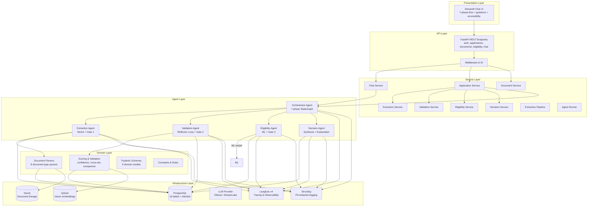
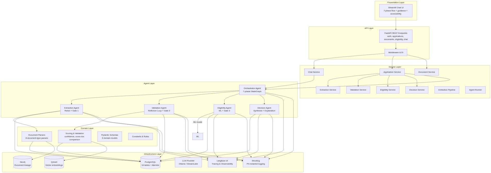

# Solution Summary — UAE Social Support Application Workflow Automation

> Cap: 10 pages. Update whenever architecture, tool choices, component boundaries, or integration points change.

---

## 1. High-Level Architecture

### Architecture Diagram

### Layer Overview

| Layer | Responsibility | Key Technologies |
|-------|---------------|-----------------|
| Presentation | Chat-based applicant UI with file upload | Streamlit 1.60.0 |
| API | REST endpoints, request routing, dependency injection | FastAPI 0.140.0 |
| Services | Business logic orchestration, agent coordination, retry/fallback | Python, LangGraph 1.2.9 |
| Agents | LLM-driven extraction, validation, eligibility, decision | LangGraph, Ollama / StreamLake |
| Domain | Pure business logic: parsing, scoring, comparison, schemas | Python, Pydantic 2.13.4 |
| Infrastructure | Persistence, embeddings, graph, observability | PostgreSQL, Neo4j 6.2.0, Qdrant 1.18.0, Langfuse 4.14.1 |

### Data Flow

1. **Phase 0 — Authentication**: Applicant enters Emirates ID number via Streamlit chat. Orchestrator validates using Luhn algorithm (`domain/utils/`).
2. **Phase 1 — Intake**: Orchestrator collects 13 applicant fields (name, DOB, marital status, children, residency, employment, salary, etc.) via LLM extraction. State is persisted to PostgreSQL with `state_snapshot` JSONB column.
3. **Phase 2 — Document Collection**: Applicant uploads documents (PDF, PNG, DOCX, XLSX). Document service classifies uploads into 6 types: Emirates ID, bank statement, credit report, resume, assets/liabilities, application form. Missing documents tracked per support category.
4. **Phase 3 — Processing**: Orchestrator invokes extraction subgraph (ReAct agent with Gate 1 document integrity check) then validation subgraph (Reflexion loop: attempt → evaluate → critique → clarify/finalize, Gate 2 completeness check).
5. **Phase 4 — Review**: Discrepancies trigger clarification questions generated from templates. Applicant responds via chat.
6. **Phase 5 — Decision**: Eligibility agent runs feature engineering + ML prediction (Gate 3 hard rules). Decision agent synthesizes all signals into outcome: approve / manual review / soft decline, with explanation and enablement package.
7. **Phase 6 — Enablement**: Post-decision recommendations delivered to applicant via UI.

All agent state flows through `ApplicantState` (25+ fields TypedDict). LangGraph PostgreSQL checkpointer persists state between phases. Every agent call is traced via Langfuse v4.

---

## 2. Tool Choice Justification

| Tool | Role | Justification |
|------|------|--------------|
| LangGraph | Agent orchestration | Chosen for its native support of cyclic graphs, checkpointing, subgraph composition, and `interrupt()` for human-in-the-loop phases. The 7-phase applicant flow requires persistent state across asynchronous document uploads — LangGraph's `PostgresSaver` checkpointer handles this without custom session management. Alternative (state machines in plain Python) would duplicate checkpointing and recovery logic. |
| FastAPI | REST API layer | Async-native, Pydantic v2 integrated, automatic OpenAPI docs. The four-layer architecture requires thin routes that delegate to services — FastAPI's dependency injection system (`Depends`) maps cleanly to this pattern. Starlette underpinning ensures compatibility with LangGraph's async execution. |
| Streamlit | Frontend UI | Chat-only interaction model is a project requirement. Streamlit's `st.chat_message` / `st.chat_input` with `accept_file="multiple"` satisfies the file-upload constraint without a separate React frontend. `@st.fragment` prevents full-page reruns during LLM streaming. Trade-off: less UI flexibility than a custom SPA, but velocity and maintainability are superior for an internal tool. |
| PostgreSQL | Relational data store | 16-table schema with strict referential integrity for applicant, application, document, and extraction data. Chosen for ACID compliance on financial/identity data, JSONB support for `state_snapshot`, and native LangGraph checkpoint integration via `langgraph-checkpoint-postgres`. Async access via `asyncpg`. |
| Neo4j | Cross-document relationship graph | Document lineage (which extraction came from which document version) and family relationships (household members across applications) are naturally graph-structured. Neo4j Cypher queries for transitive relationships are orders of magnitude simpler than recursive SQL. Used sparingly — only for lineage and family graphs, not primary data. |
| Qdrant | Vector search / embeddings | Dense vector storage for document similarity (duplicate detection, semantic search across applications). Local embeddings via Ollama, stored in Qdrant with HNSW indexing. Chosen over Pinecone for self-hosted deployment parity with the rest of the stack. |
| Langfuse | Observability and tracing | v4 self-hosted stack (ClickHouse, Redis, MinIO) provides trace-level visibility into every LLM call, agent node transition, and tool invocation. Critical for debugging ReAct/Reflexion loops where the same agent may iterate 3–5 times. Prompt versioning and dataset management support the evaluation framework. |
| Ollama | Local LLM inference | Runs Llama 3.2 / Mistral locally for extraction, validation, and decision agents. Eliminates PII egress to third-party APIs — a hard requirement for UAE government social support data. StreamLake (Azure OpenAI-compatible) is the fallback for production when local GPU is unavailable. Provider switching is a single `LLM_PROVIDER` env var. |
| Pydantic | Data validation and schemas | 9 domain schema files define every agent I/O contract. v2 `field_validator` and `model_validator` enforce business rules (e.g., Emirates ID length, income thresholds) at parse time. `SecretStr` for sensitive fields. Integrated with FastAPI for automatic request validation. |
| structlog | Structured logging | JSON output with PII redaction processor — identity numbers, names, and account numbers are automatically masked before writing. Event-based logging (`"document_extracted"`, `"node_enter"`) with mandatory `duration_ms` on all timed operations. Complements Langfuse traces for operations that don't involve LLM calls. |
| Alembic | Database migrations | Autogenerate from SQLAlchemy ORM models. Two migrations shipped: initial 16-table schema and `state_snapshot` column addition. Downgrade paths verified. Standard tool for Python/SQLAlchemy projects — no alternative considered. |

---

## Data-Type Tool Justification

The case study requires justification of specific tools for specific data types. The table above covers *why* each technology was chosen; this section addresses *which tool handles which data type*.

| Data Type | Tool | Justification |
|-----------|------|---------------|
| **Text** (PDF, DOCX) | pymupdf4llm, python-docx | pymupdf4llm extracts text + layout from PDFs with high fidelity, preserving headings, paragraphs, and tables. python-docx handles DOCX with preserved formatting. Both are pure Python, no external dependencies, and work reliably on UAE government document formats. |
| **Images** (PNG, JPG) | PaddleOCR | State-of-the-art OCR for Arabic + English text; handles low-quality scans, skewed documents, and handwritten forms. Local inference via Ollama-compatible API (no PII egress to third-party services). |
| **Tabular** (PDF tables, XLSX) | camelot-py, openpyxl | camelot-py extracts tables from PDFs using lattice (line-detection) and stream (whitespace-detection) modes; openpyxl reads XLSX with full cell-type support (numbers, dates, formulas). Both preserve table structure for downstream cross-document validation. |
| **Structured data** (JSON) | Pydantic v2 | All agent I/O validated against Pydantic schemas with `field_validator` and `model_validator`. Enforces business rules (Emirates ID length, income thresholds, date formats) at parse time. `SecretStr` for sensitive fields. Integrated with FastAPI for automatic request validation. |

**Multimodal processing pipeline:** Document uploads → `domain/document_classifier.py` (file path → doc type) → `src/infrastructure/document_processing/` (unified extraction API) → per-type parser (pymupdf4llm for PDF, PaddleOCR for images, camelot-py for tables, python-docx for DOCX, openpyxl for XLSX) → structured JSON output → Pydantic validation → PostgreSQL persistence.

---

## Scikit-Learn Algorithm Justification

The case study requires justification of scikit-learn algorithms for classification based on data characteristics and problem statement.

**Intended algorithm:** Gradient Boosting Classifier (with RandomForest as baseline)

**Rationale based on data characteristics:**

- **Feature types:** Mixed (demographic: categorical + numerical; financial: continuous). Gradient boosting handles mixed types without extensive preprocessing (unlike neural networks which require normalization and encoding).
- **Dataset size:** Synthetic test data is small (<1000 profiles). Gradient boosting performs well on small-to-medium datasets without overfitting (unlike deep learning which requires large datasets).
- **Interpretability requirement:** Government social support decisions must be explainable. Gradient boosting provides feature importance scores (via `feature_importances_`), supporting the "explanation" output in the decision agent. SHAP values can be computed post-hoc for per-decision explainability.
- **Class imbalance:** Approval rates may be skewed (e.g., 60% approve, 30% manual review, 10% soft decline). Gradient boosting supports `class_weight='balanced'` parameter to handle imbalance without manual resampling.
- **Non-linear relationships:** Income thresholds, residency duration requirements, and family size interactions are non-linear. Tree-based models capture these without manual feature engineering (unlike logistic regression which requires polynomial features or interaction terms).
- **Missing data handling:** Real applications may have missing fields. Gradient boosting handles missing values natively (learns default direction at each split).

**Baseline comparison:** Logistic regression as baseline for interpretability (coefficients as feature importance); if gradient boosting performance is comparable, prefer logistic regression for simplicity. Otherwise, gradient boosting.

**Current status:** ML model is a stub in prototype phase (`src/ml/eligibility_model.py`). Real model requires training data from historical applications (not available for prototype). Feature engineering pipeline (`src/ml/feature_engineering.py`) is complete and ready for model training — extracts demographic features (employment status, children count, residency duration) and financial features (monthly salary, credit score, assets/liabilities ratio).

---

## 3. Modular Workflow Breakdown

### Orchestrator Agent

- **Responsibility**: Coordinates the 7-phase applicant flow (Phase 0 authentication through Phase 6 enablement). Manages phase transitions, interrupt points for applicant input, and subgraph invocation.
- **Inputs**: `ApplicantState` (session messages, phase index, extracted data, validation results, eligibility factors, gate statuses), uploaded document file paths.
- **Outputs**: Phase transition signals, interrupt requests for applicant clarification, final decision trigger.
- **Interfaces**: Invokes extraction, validation, eligibility, and decision subgraphs. Calls `chat_service` for message history, `application_service` for lifecycle transitions. Does not access infrastructure directly — delegates to services.
- **Internal structure**: `graph.py` (StateGraph definition with conditional edges), `nodes.py` (re-exports from `phases/`), `phases/` (7 files, one per phase), `routes.py` (deterministic routing logic), `di.py` (LLM and service injection).

### Extraction Agent

- **Responsibility**: Parses uploaded documents into structured fields using a ReAct agent loop. Runs Gate 1 (document integrity / tamper detection) before extraction begins.
- **Inputs**: Document file paths, document type classification, applicant context.
- **Outputs**: `ExtractionOutput` per document — structured fields with per-field confidence scores. Written to PostgreSQL `document_extraction_fields` table.
- **Interfaces**: Calls domain parsers (`domain/parsers/`) for rule-based extraction, LLM for unstructured extraction, `extraction_persistence` infrastructure for write-back. Gate 1 lives in `agents/gates/document_integrity.py`.
- **Internal structure**: `graph.py` (extract → summarize nodes), `nodes.py` (ReAct invocation, Gate 1 integration), `agent_runner.py` (LLM construction, single-document processing), `parsers.py` (JSON extraction, regex fallback), `prompts.py` (per-document-type extraction prompts).

### Validation Agent

- **Responsibility**: Cross-document consistency checks (identity, name, income, address across all uploaded documents). Discrepancy classification (OCR error vs. real discrepancy). Generates clarification questions when confidence is low.
- **Inputs**: Extracted data from all documents for an applicant.
- **Outputs**: Validation scores per field, discrepancy flags with classification, clarification questions from templates, overall confidence score.
- **Interfaces**: Calls `domain/cross_document.py` comparison functions, `domain/discrepancy_classifier.py`, `domain/scoring/`. Triggers Reflexion loop on low confidence. Gate 2 (completeness) runs after finalization.
- **Internal structure**: `graph.py` (Reflexion topology: attempt → evaluate → critique → clarify/finalize), `nodes.py` (6 node functions), `tools.py` (including `applicant_clarify_tool`), `prompts.py` (evaluation and critique prompts).

### Eligibility Agent

- **Responsibility**: ML-based eligibility scoring with demographic and financial feature engineering. Applies factor adjustments for edge cases.
- **Inputs**: Validated extracted data, demographic features (employment status, salary, children count, residency duration, credit score).
- **Outputs**: Eligibility score (0–1), top contributing factors, Gate 3 pass/fail status.
- **Interfaces**: Calls `ml/eligibility_model.py` (stub) and `ml/feature_engineering.py`. Gate 3 (`agents/gates/eligibility_rules.py`) enforces hard rules (minimum residency, maximum income threshold, identity verification).
- **Internal structure**: `graph.py` (feature engineering → ML prediction → factor adjustment), `nodes.py` (3 node functions), `prompts.py` (factor explanation prompts).

### Decision Agent

- **Responsibility**: Final decision synthesis from all upstream signals. Generates human-readable explanation and enablement package.
- **Inputs**: All agent outputs (extraction, validation, eligibility), gate statuses (1–3), validation confidence scores, eligibility score and factors.
- **Outputs**: Decision enum (`approved`, `manual_review`, `soft_decline`), explanation text, enablement recommendations (conditional on support category), formatted response for UI.
- **Interfaces**: Reads gate results — does not re-evaluate. Formats output via `domain/schemas/decision.py`. Writes final decision to `applications` table via `application_service`.
- **Internal structure**: `graph.py` (decision → explanation → enablement nodes), `nodes.py` (decision logic, explanation generation, enablement packaging), `prompts.py` (decision rationale prompts).

### Deterministic Gates

| Gate | Location | Trigger | Logic |
|------|----------|---------|-------|
| Gate 1 | `agents/gates/document_integrity.py` | Before extraction | Tamper detection, format validation, file hash verification |
| Gate 2 | `agents/gates/completeness.py` | After validation finalization | Document completeness per support category, required field presence |
| Gate 3 | `agents/gates/eligibility_rules.py` | After ML prediction | Hard eligibility rules: residency duration, income ceiling, identity verification |
| Retry | `agents/gates/retry_logic.py` | On any gate failure | Configurable retry count, exponential backoff, fallback to manual review |

---

## 4. Future Improvements and Integration

### Suggested Improvements

- **Production LLM failover**: Currently binary (Ollama or StreamLake). Add a tiered fallback chain (local Ollama → Azure OpenAI → AWS Bedrock) with automatic health checks and per-request provider selection based on latency and availability.
- **Real-time document processing queue**: The `document_processing_queue` table exists but is not yet wired to a background worker. Implementing Celery or ARQ workers would allow asynchronous extraction of large PDFs without blocking the chat flow.
- **Multi-language support**: Agent prompts are English-only. Adding Arabic locale support (already partially implemented in `data_generation/` via Mimesis Arabic locale) would require prompt localization and RTL UI adjustments in Streamlit.
- **Evaluation accuracy datasets**: The 3 accuracy-focused eval scripts (`evals/test_extraction_accuracy.py`, `test_validation_rules.py`, `test_eligibility_scoring.py`) exist at the `evals/` root level outside the four-layer framework directories. They need ground-truth datasets and metric calculation. The four-layer correctness framework (audit, golden dataset, schema contracts, live integration) is complete — 50+ tests validating all 19 agent tools. Langfuse datasets can store labeled cases for regression tracking.

### API Design Considerations

- **Idempotency keys**: Application creation endpoints should accept idempotency keys to prevent duplicate applications from network retries — critical for government benefit systems where duplicate submissions create audit liabilities.
- **Webhook callbacks**: Long-running extraction and validation operations should notify external systems via webhooks rather than requiring polling. The `application_service` already tracks status transitions — adding a webhook dispatcher on transition would be minimal work.
- **Pagination and filtering**: The applications and documents list endpoints need cursor-based pagination and filter-by-status. Current implementations return full collections, which will not scale beyond hundreds of records.
- **Rate limiting**: No rate limiting exists on chat or document upload endpoints. FastAPI middleware should enforce per-applicant rate limits to prevent abuse of the LLM pipeline.

### Data Pipeline Integration with Existing Systems

- **Government identity verification API**: The Emirates ID Luhn check is local-only. Integrating with the UAE ICA (Federal Authority for Identity and Citizenship) API would provide real-time identity verification, replacing the current heuristic check.
- **Banking data aggregation**: Instead of requiring PDF bank statements, integration with UAE open banking APIs (when available) would provide structured transaction data directly, eliminating OCR error modes.
- **Credit bureau real-time pull**: The AECB credit report is currently a static PDF upload. A real-time API integration with AECB would provide current credit scores and facility data, reducing fraud surface.
- **Case management system export**: Approved applications need to flow into the downstream social support case management system. A batch export job (nightly CSV/SFTP) or real-time REST push would close the loop between automated decision and benefit disbursement.
- **Audit trail compliance**: The `document_audit_log` table provides immutability, but exporting audit trails in a format compliant with UAE government record-keeping standards (long-term archival, digital signatures) would be required for production deployment.

---

*Last updated: 2026-07-27 — Added four-layer evaluation framework (audit, golden dataset, schema contracts, live integration) validating 19 agent tools across 50+ tests.*
