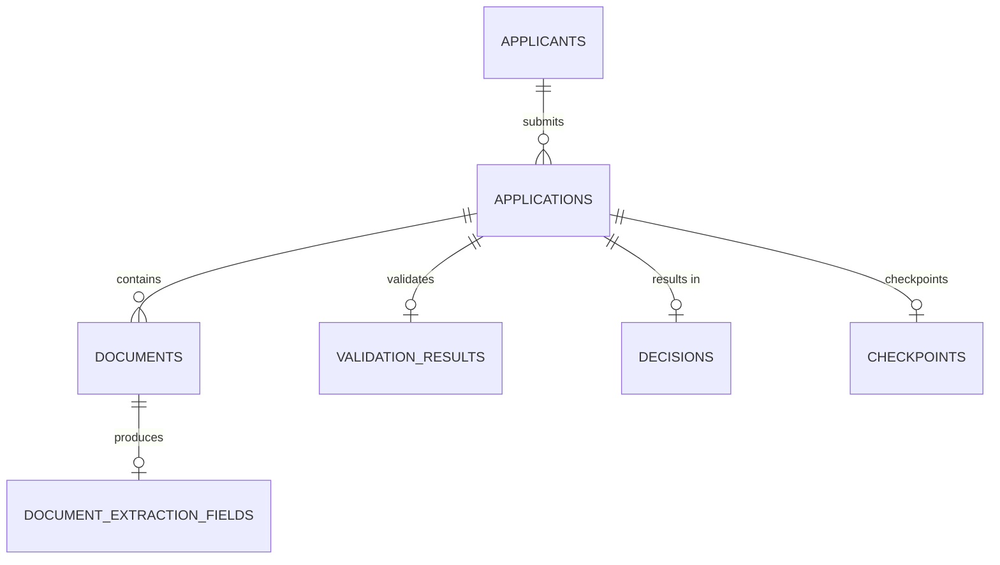

# Architecture Documentation Suite Implementation Plan

> **For agentic workers:** REQUIRED SUB-SKILL: Use superpowers:subagent-driven-development (recommended) or superpowers:executing-plans to implement this plan task-by-task. Steps use checkbox (`- [ ]`) syntax for tracking.

**Goal:** Create a comprehensive architecture documentation suite comprising ADRs, architecture.md, security-privacy.md, api-design.md, and data-dictionary.md to demonstrate decision-making rigor and production-readiness thinking for the UAE Social Support Application assignment.

**Architecture:** The documentation suite is organized into `docs/adr/` for decision records and `docs/` for reference documents. ADRs capture the "why" behind architectural choices, while the other documents describe the "what" and "how" of the system. All documents are derived from the existing codebase — no implementation changes required.

**Tech Stack:** Markdown, Mermaid diagrams for architecture visualizations, standard ADR template format.

## Global Constraints

- All documents must be derived from the existing codebase (no fictional content)
- ADRs must follow the standard template: Context, Decision, Alternatives Considered, Consequences
- architecture.md must follow the "Living Architecture" template at L2 depth
- All documents must reference each other where appropriate (no isolated silos)
- Documents must be written in professional, concise technical English

---

## File Structure

| File | Responsibility |
|------|---------------|
| `docs/adr/README.md` | ADR index table |
| `docs/adr/0001-langgraph-orchestration.md` | ADR: LangGraph for agent orchestration |
| `docs/adr/0002-polyglot-persistence.md` | ADR: PostgreSQL + Neo4j + Qdrant |
| `docs/adr/0003-four-layer-architecture.md` | ADR: Four-layer architecture |
| `docs/adr/0004-local-llm-fallback.md` | ADR: Local LLM with cloud fallback |
| `docs/adr/0005-structured-logging-pii.md` | ADR: Structured logging with PII redaction |
| `docs/adr/0006-dox-framework.md` | ADR: DOX framework for AI agent steering |
| `docs/architecture.md` | Structured architecture document (10 sections) |
| `docs/security-privacy.md` | Security and privacy practices |
| `docs/api-design.md` | API design principles and catalog |
| `docs/data-dictionary.md` | PostgreSQL schema documentation |

---

### Task 1: ADR Index and First Two ADRs

**Files:**
- Create: `docs/adr/README.md`
- Create: `docs/adr/0001-langgraph-orchestration.md`
- Create: `docs/adr/0002-polyglot-persistence.md`

**Interfaces:**
- Consumes: Existing codebase knowledge (src/agents/, src/infrastructure/)
- Produces: ADR index and first two decision records

- [ ] **Step 1: Create ADR directory and index**

Create `docs/adr/README.md`:

```markdown
# Architecture Decision Records

This directory contains Architecture Decision Records (ADRs) for the UAE Social Support Application.

Each ADR captures a significant architectural choice, the context behind it, alternatives considered, and consequences.

## Index

| ADR | Title | Status |
|-----|-------|--------|
| [0001](0001-langgraph-orchestration.md) | Use LangGraph for Agent Orchestration | accepted |
| [0002](0002-polyglot-persistence.md) | Polyglot Persistence (PostgreSQL + Neo4j + Qdrant) | accepted |
| [0003](0003-four-layer-architecture.md) | Four-Layer Architecture | accepted |
| [0004](0004-local-llm-fallback.md) | Local LLM via Ollama with Cloud Fallback | accepted |
| [0005](0005-structured-logging-pii.md) | Structured Logging with PII Redaction | accepted |
| [0006](0006-dox-framework.md) | DOX Framework for AI Agent Steering | accepted |
```

- [ ] **Step 2: Write ADR 0001 — LangGraph Orchestration**

Create `docs/adr/0001-langgraph-orchestration.md`:

```markdown
# ADR 0001: Use LangGraph for Agent Orchestration

## Status

Accepted

## Context

The UAE Social Support Application requires a 7-phase applicant flow (authentication, intake, document collection, processing, review, decision, enablement) with persistent state between phases, interrupt points for human input, and subgraph composition for extraction, validation, eligibility, and decision agents.

The system must support:
- Cyclic execution (reflexion loops in validation agent)
- Checkpointing for crash recovery and session persistence
- Human-in-the-loop interrupts for clarification questions
- Subgraph composition (extraction, validation, eligibility, decision as subgraphs of orchestrator)

## Decision

Use LangGraph as the agent orchestration framework.

LangGraph provides:
- Native support for cyclic graphs (required for Reflexion loops)
- `PostgresSaver` checkpointer for persistent state between phases
- `interrupt()` for human-in-the-loop clarification
- Subgraph composition (each agent is a subgraph of the orchestrator)
- Async execution compatible with FastAPI

## Alternatives Considered

### Plain Python State Machines

Would require implementing checkpointing, recovery, and interrupt logic from scratch. Duplicates infrastructure that LangGraph provides natively.

### CrewAI

Focused on multi-agent collaboration patterns, not state machine orchestration. Does not provide the cyclic graph support needed for Reflexion loops.

### Custom Async Framework

Building a custom orchestration layer would be a significant undertaking with no competitive advantage over LangGraph's battle-tested implementation.

## Consequences

### Positive
- Native checkpointing eliminates custom session management
- Cyclic graph support enables Reflexion loops naturally
- Subgraph composition keeps agents decoupled
- Active community and regular updates

### Negative
- LangGraph-specific abstractions (StateGraph, channels) create a learning curve
- Checkpointer adds a PostgreSQL dependency for all agent execution
- Debugging complex graph execution requires Langfuse integration

### Risks
- LangGraph API evolution may require migration (mitigated by wrapping graph construction in `graph.py` modules)
```

- [ ] **Step 3: Write ADR 0002 — Polyglot Persistence**

Create `docs/adr/0002-polyglot-persistence.md`:

```markdown
# ADR 0002: Polyglot Persistence (PostgreSQL + Neo4j + Qdrant)

## Status

Accepted

## Context

The UAE Social Support Application handles multiple data shapes:
- Relational data: applicants, applications, documents, extraction results (ACID compliance required for financial/identity data)
- Graph data: document lineage (which extraction came from which document version), family relationships across applications
- Vector data: document embeddings for similarity search, duplicate detection, semantic search

A single database would force one data model to fit all shapes, resulting in complex queries and poor performance.

## Decision

Use three databases, each optimized for its data shape:

1. **PostgreSQL** — Primary data store for applicants, applications, documents, extraction results. 16-table schema with strict referential integrity, JSONB for state snapshots, Alembic migrations.

2. **Neo4j** — Graph database for document lineage and family relationships. Cypher queries for transitive relationships are orders of magnitude simpler than recursive SQL. Used sparingly — only for lineage and family graphs, not primary data.

3. **Qdrant** — Vector database for document embeddings. HNSW indexing for similarity search. Local embeddings via Ollama, stored in Qdrant for self-hosted deployment parity.

## Alternatives Considered

### PostgreSQL Only (pgvector, recursive CTEs)

pgvector provides vector search but with inferior HNSW performance compared to Qdrant. Recursive CTEs for graph queries are verbose and slow compared to Cypher. Would couple all data access to a single database, creating a bottleneck.

### MongoDB (Document Store)

Schemaless design conflicts with the strict validation requirements for financial/identity data. No native graph or vector capabilities.

### Single Cloud Provider (AWS RDS + Neptune + OpenSearch)

Violates the local-first deployment requirement. Government PII cannot egress to third-party cloud by default.

## Consequences

### Positive
- Each database is optimized for its data shape
- Independent scaling per database
- Clear separation of concerns

### Negative
- Three databases to manage, monitor, and back up
- Cross-database transactions not possible (eventual consistency for graph/vector updates)
- Higher infrastructure complexity

### Risks
- Data consistency between PostgreSQL and Neo4j/Qdrant (mitigated by updating graph/vector stores as post-commit hooks, not in the same transaction)
```

- [ ] **Step 4: Commit**

```bash
git add docs/adr/
git commit -m "docs: add ADR index and first two decision records (LangGraph, polyglot persistence)"
```

---

### Task 2: Remaining Four ADRs

**Files:**
- Create: `docs/adr/0003-four-layer-architecture.md`
- Create: `docs/adr/0004-local-llm-fallback.md`
- Create: `docs/adr/0005-structured-logging-pii.md`
- Create: `docs/adr/0006-dox-framework.md`

**Interfaces:**
- Consumes: ADR index from Task 1
- Produces: Four remaining decision records

- [ ] **Step 1: Write ADR 0003 — Four-Layer Architecture**

Create `docs/adr/0003-four-layer-architecture.md`:

```markdown
# ADR 0003: Four-Layer Architecture

## Status

Accepted

## Context

The UAE Social Support Application is a complex system with multiple concerns: HTTP request handling, business logic orchestration, LLM-driven agent execution, and infrastructure integration (databases, LLM providers, observability).

Without clear architectural boundaries, the codebase would become a tangled dependency graph where changes in one area ripple unpredictably through others.

## Decision

Enforce a strict four-layer architecture with unidirectional dependencies:

1. **API Layer** (`src/api/`) — Thin HTTP endpoints (5-12 lines). Parse input, call service, format output. No business logic.

2. **Services Layer** (`src/services/`) — Business logic orchestration. Own agent loop, session state, retry/fallback. Routes call services.

3. **Agents + Domain Layer** (`src/agents/`, `src/domain/`) — LangGraph agent definitions and pure domain logic. Services call agents.

4. **Infrastructure Layer** (`src/infrastructure/`) — External services (DB, LLM, vector DB, graph DB). Agents and services call infrastructure.

**Dependency rule:** Each layer imports only from layers below. No circular imports. Domain layer has no I/O.

## Alternatives Considered

### Feature-Based Layering

Organize by feature (auth, documents, eligibility) rather than technical layer. Works well for CRUD applications but conflicts with the agent-centric architecture where cross-cutting concerns (extraction, validation, decision) span multiple features.

### Hexagonal Architecture (Ports and Adapters)

More abstract. The four-layer approach is simpler to understand and enforce for a team that includes AI agents (via DOX framework).

### No Explicit Architecture

Let developers organize code as they see fit. Results in inconsistent patterns, tangled dependencies, and high onboarding cost.

## Consequences

### Positive
- Clear dependency direction prevents circular imports
- Each layer can be tested independently (mock layers below)
- New developers can understand the system by learning one layer at a time
- AI coding agents can be steered with layer-specific rules

### Negative
- Some boilerplate for simple operations (route → service → agent → repository)
- Requires discipline to keep routes thin

### Risks
- Over-engineering for simple CRUD operations (mitigated by allowing services to call infrastructure directly for non-agent operations)
```

- [ ] **Step 2: Write ADR 0004 — Local LLM Fallback**

Create `docs/adr/0004-local-llm-fallback.md`:

```markdown
# ADR 0004: Local LLM via Ollama with Cloud Fallback

## Status

Accepted

## Context

The UAE Social Support Application processes citizen PII (Emirates ID numbers, financial data, family details). Government data handling requirements mandate that PII should not egress to third-party APIs unless necessary.

However, local LLM inference requires GPU resources that may not be available in all deployment environments.

## Decision

Use a dual-provider strategy:
- **Primary:** Ollama running locally (Llama 3.2 / Mistral / Qwen models)
- **Fallback:** StreamLake (Azure OpenAI-compatible API) when local GPU is unavailable

Provider switching is controlled by a single `LLM_PROVIDER` environment variable (`ollama` or `streamlake`).

Embeddings always run locally via Ollama (`nomic-embed-text:v1.5`) regardless of LLM provider.

## Alternatives Considered

### Cloud-Only (OpenAI, Azure OpenAI)

Simplest deployment but violates PII egress constraints for government data.

### Local-Only

Most secure but requires GPU in every deployment environment. Not feasible for all deployment scenarios.

### Multi-Cloud Fallback Chain

Add AWS Bedrock, Google Vertex AI as additional fallbacks. Over-engineered for a prototype. Can be added later if needed.

## Consequences

### Positive
- PII stays local by default
- Cloud fallback provides deployment flexibility
- Single environment variable controls provider

### Negative
- Two provider configurations to maintain
- Model behavior may differ between providers (mitigated by using similar model families)

### Risks
- Local Ollama performance depends on available GPU (mitigated by documenting minimum requirements)
```

- [ ] **Step 3: Write ADR 0005 — Structured Logging with PII Redaction**

Create `docs/adr/0005-structured-logging-pii.md`:

```markdown
# ADR 0005: Structured Logging with PII Redaction

## Status

Accepted

## Context

The UAE Social Support Application processes sensitive citizen data. Logs must not contain PII values (identity numbers, names, account numbers) but must provide sufficient observability for debugging and audit purposes.

Standard `logging` module produces unstructured text that is difficult to query and may accidentally include PII.

## Decision

Use `structlog` with a custom PII redaction processor:

1. **Structured output:** JSON format in production, colored console in development
2. **PII redaction:** Custom processor automatically masks sensitive keys (identity_number, full_name, account_number, phone, email)
3. **Event-based:** Log events in snake_case (`"document_extracted"`, `"node_enter"`, `"request_complete"`)
4. **Mandatory timing:** All timed operations log `duration_ms`
5. **Named loggers:** `structlog.get_logger(__name__)` for traceability

## Alternatives Considered

### Standard Logging

Produces unstructured text, no built-in PII redaction, harder to integrate with observability platforms.

### Loguru

Good developer experience but less mature structured output and no built-in PII redaction.

### No PII Redaction

Unacceptable for government data. Would fail security review.

## Consequences

### Positive
- PII automatically redacted before writing
- JSON output integrates with Langfuse and log aggregation
- Event-based logging is queryable and analyzable

### Negative
- Requires discipline to log only IDs, counts, statuses (not PII values)
- Custom processor adds complexity to logging setup

### Risks
- New PII fields must be added to redaction list (mitigated by code review checklist)
```

- [ ] **Step 4: Write ADR 0006 — DOX Framework**

Create `docs/adr/0006-dox-framework.md`:

```markdown
# ADR 0006: DOX Framework for AI Agent Steering

## Status

Accepted

## Context

This project is developed with significant AI coding agent assistance (Cursor, Claude Code). Without explicit steering, AI agents make inconsistent architectural decisions, introduce circular imports, and violate established patterns.

Traditional documentation (README, architecture docs) is read by humans but not consistently consulted by AI agents during coding sessions.

## Decision

Implement the DOX (Documentation-Oriented X) framework:
- `AGENTS.md` files at strategic boundaries (root, src/, ui/, tests/, etc.)
- Each file contains binding work contracts for its subtree
- Nearest file to code takes precedence for local work details
- Parent docs control repo-wide rules; no child doc may weaken DOX

The root `AGENTS.md` contains:
- Four-layer architecture contract
- File size and decomposition guardrails
- Tool thinness rules
- Service delegation rules
- LangGraph agent structure conventions
- User preferences (solution summary, README, pre-planning requirements)

## Alternatives Considered

### CLAUDE.md Only

Single file at root. Loses the hierarchical precedence model and local boundary contracts.

### No Agent Steering

AI agents make inconsistent decisions, introduce technical debt, and violate architecture.

### Pre-commit Hooks Only

Catches violations after the fact rather than preventing them.

## Consequences

### Positive
- AI agents consult rules before every edit
- Architecture violations prevented at the source
- Hierarchical model allows local customization
- Living documentation evolves with the codebase

### Negative
- Requires maintaining AGENTS.md files alongside code changes
- AI agents may over-constrain themselves

### Risks
- Conflicting rules between parent and child docs (mitigated by "closer doc controls, but no child may weaken DOX")
```

- [ ] **Step 5: Commit**

```bash
git add docs/adr/0003-four-layer-architecture.md docs/adr/0004-local-llm-fallback.md docs/adr/0005-structured-logging-pii.md docs/adr/0006-dox-framework.md
git commit -m "docs: add remaining four ADRs (layering, LLM fallback, logging, DOX)"
```

---

### Task 3: Structured Architecture Document

**Files:**
- Create: `docs/architecture.md`

**Interfaces:**
- Consumes: ADRs from Tasks 1-2, existing codebase
- Produces: Living architecture document with 10 sections

- [ ] **Step 1: Write architecture.md**

Create `docs/architecture.md` with the following structure (full content derived from existing codebase):

```markdown
# Architecture — UAE Social Support Application

> Living document. Update as the codebase evolves.

## 1. Tech Stack

| Component | Technology | Version | Purpose |
|-----------|-----------|---------|---------|
| Language | Python | 3.11.12 | Application runtime |
| API | FastAPI | 0.140.0 | REST endpoints |
| Frontend | Streamlit | 1.60.0 | Chat-based UI |
| Agent Orchestration | LangGraph | 1.2.9 | StateGraph, checkpointing |
| Relational DB | PostgreSQL | 16 | Primary data store (16 tables) |
| Graph DB | Neo4j | 6.2.0 | Document lineage, family graphs |
| Vector DB | Qdrant | 1.18.0 | Document embeddings |
| LLM (local) | Ollama | latest | Local LLM inference |
| LLM (cloud) | StreamLake | — | Cloud fallback (Azure OpenAI-compatible) |
| Observability | Langfuse | 4.14.1 | Tracing, prompt versioning |
| Logging | structlog | — | PII-redacted structured logging |
| Migrations | Alembic | — | SQLAlchemy schema evolution |

See [ADR 0001](adr/0001-langgraph-orchestration.md) for LangGraph rationale.
See [ADR 0002](adr/0002-polyglot-persistence.md) for database rationale.
See [ADR 0004](adr/0004-local-llm-fallback.md) for LLM provider rationale.

## 2. Module Map

```
src/
├── api/              # FastAPI routes (thin: parse → call service → format)
│   ├── v1/           # Versioned endpoints
│   │   ├── auth.py
│   │   ├── applications.py
│   │   ├── documents.py
│   │   ├── eligibility.py
│   │   └── chat.py
│   ├── router.py     # Route registration
│   └── deps.py       # Dependency injection
├── services/         # Business logic orchestration
│   ├── auth_service.py
│   ├── chat_service.py
│   ├── application_service.py
│   ├── document_service.py
│   ├── extraction_service.py
│   ├── validation_service.py
│   ├── eligibility_service.py
│   └── decision_service.py
├── agents/           # LangGraph agent definitions
│   ├── orchestrator/ # 7-phase state machine
│   ├── extraction/   # ReAct agent + Gate 1
│   ├── validation/   # Reflexion loop + Gate 2
│   ├── eligibility/  # ML scoring + Gate 3
│   ├── decision/     # Synthesis agent
│   ├── gates/        # Deterministic validation gates
│   ├── state.py      # TypedDict for agent state
│   └── checkpointer.py # Shared PostgreSQL checkpointer
├── domain/           # Pure business logic (no I/O)
│   ├── parsers/      # Per-document-type parsing
│   ├── scoring/      # Confidence, validation scoring
│   ├── cross_document.py
│   ├── discrepancy_classifier.py
│   ├── document_classifier.py
│   ├── schemas/      # Pydantic models
│   ├── templates/    # Clarification question templates
│   └── constants/    # Domain constants
├── infrastructure/   # External service integration
│   ├── db/           # SQLAlchemy models, repositories, session
│   ├── document_processing/ # PDF parsing, OCR, table extraction
│   ├── graph/        # Neo4j integration
│   ├── llm/          # LLM client factory
│   ├── vector/       # Qdrant integration
│   └── observability/ # Langfuse, structlog
├── ml/               # ML eligibility model (stub)
├── data_generation/  # Synthetic test data generators
└── utils/            # Shared utilities
    ├── circuit_breaker.py
    ├── retry.py
    ├── error_classifier.py
    └── state_size.py
```

See [ADR 0003](adr/0003-four-layer-architecture.md) for layering rationale.

## 3. Data Flow

### Request Lifecycle

1. **UI → API:** Streamlit chat input → FastAPI `/api/v1/chat` endpoint
2. **API → Service:** Route parses request, calls `ChatService.handle_chat()`
3. **Service → Agent:** ChatService invokes orchestrator graph via `run()` or `run_streaming()`
4. **Agent → Subgraphs:** Orchestrator routes to extraction/validation/eligibility/decision subgraphs
5. **Agent → Domain:** Agents call domain parsers, scoring, comparison functions
6. **Agent → Infrastructure:** Services persist results to PostgreSQL, Neo4j, Qdrant
7. **Agent → Observability:** All calls traced via Langfuse, logged via structlog
8. **Service → API:** Service returns response, route formats JSON
9. **API → UI:** Streamlit renders response in chat message

### Phase Transitions

```
Phase 0 (Auth) → Phase 1 (Intake) → Phase 2 (Documents) → Phase 3 (Processing)
                                                      ↓
Phase 6 (Enablement) ← Phase 5 (Decision) ← Phase 4 (Review)
```

See [Solution Summary](solution-summary.md) Section 1 for detailed data flow diagram.

## 4. API Structure

### Endpoint Catalog

| Method | Path | Service | Purpose |
|--------|------|---------|---------|
| POST | `/api/v1/auth/login` | AuthService | Login with Emirates ID |
| POST | `/api/v1/chat` | ChatService | Send chat message |
| GET | `/api/v1/chat/{session_id}` | ChatService | Get chat history |
| POST | `/api/v1/applications` | ApplicationService | Create application |
| GET | `/api/v1/applications/{id}` | ApplicationService | Get application |
| POST | `/api/v1/documents/upload` | DocumentService | Upload documents |
| GET | `/api/v1/documents/{app_id}` | DocumentService | List application documents |
| GET | `/api/v1/eligibility/{app_id}` | EligibilityService | Get eligibility score |
| GET | `/api/v1/health/langgraph` | — | Health check |

See [API Design](api-design.md) for full endpoint documentation.

## 5. Data Model

### Entity Overview

```
Applicant (1) ──→ (many) Application
Application (1) ──→ (many) Document
Document (1) ──→ (1) DocumentExtraction
Application (1) ──→ (1) Decision
```

### Key Tables

| Table | Purpose | Key Fields |
|-------|---------|------------|
| `applicants` | Applicant identity | identity_number, full_name, date_of_birth |
| `applications` | Application lifecycle | applicant_id, status, phase, state_snapshot |
| `documents` | Uploaded documents | application_id, document_type, file_path, status |
| `document_extraction_fields` | Extracted data | document_id, field_name, field_value, confidence |
| `validation_results` | Cross-document validation | application_id, field_name, is_consistent, discrepancy_type |
| `decisions` | Final decision | application_id, decision, explanation, enablement_package |
| `checkpoints` | LangGraph state | thread_id, checkpoint, created_at |

See [Data Dictionary](data-dictionary.md) for full schema documentation.

## 6. Configuration

### Environment Variables

| Variable | Required | Default | Description |
|----------|----------|---------|-------------|
| `DATABASE_URL` | Yes | — | PostgreSQL connection string |
| `NEO4J_AUTH` | Yes | — | Neo4j credentials |
| `LLM_PROVIDER` | Yes | `streamlake` | `ollama` or `streamlake` |
| `LANGFUSE_PUBLIC_KEY` | No | — | Langfuse SDK key |
| `LANGFUSE_SECRET_KEY` | No | — | Langfuse SDK secret |
| `LOG_FORMAT` | No | `console` | `console` or `json` |
| `LOG_LEVEL` | No | `INFO` | `DEBUG`, `INFO`, `WARNING`, `ERROR` |

See [README](../README.md) for full environment variable documentation.

## 7. Security

### PII Handling

- Identity numbers, names, account numbers automatically redacted in logs
- PII redaction processor in `src/infrastructure/observability/logging.py`
- Local LLM inference keeps PII on-premises by default

See [Security & Privacy](security-privacy.md) for comprehensive security documentation.

## 8. Constraints

### Known Limitations

- ML eligibility model is a stub (requires historical approval data for training)
- Document processing is synchronous (blocks chat flow for large PDFs)
- No rate limiting on chat/document upload endpoints
- No idempotency keys on application creation
- Agent prompts are English-only (no Arabic locale support yet)

### Assumptions

- Applicants have valid Emirates ID numbers (Luhn-valid)
- Uploaded documents are in supported formats (PDF, PNG, JPG, DOCX, XLSX)
- Single application per applicant (no duplicate detection)

## 9. Tech Debt

| ID | Description | Location | Priority |
|----|-------------|----------|----------|
| TD-001 | Wire document processing queue to background worker | src/services/document_service.py | Medium |
| TD-002 | Add rate limiting middleware | src/api/ | Medium |
| TD-003 | Implement idempotency keys for application creation | src/api/v1/applications.py | Medium |
| TD-004 | Add Arabic locale support for agent prompts | src/agents/*/prompts.py | Low |
| TD-005 | Complete evaluation accuracy tests (3 stubs) | evals/ | Low |

## 10. Code Hotspots

### Files Most Likely to Change

| File | Why | Related ADR |
|------|-----|-------------|
| `src/agents/orchestrator/phases/` | New phases, phase logic changes | ADR 0001 |
| `src/infrastructure/db/models/` | Schema evolution | ADR 0002 |
| `src/infrastructure/llm/factory.py` | New LLM providers | ADR 0004 |
| `src/infrastructure/observability/logging.py` | New PII fields | ADR 0005 |
| `AGENTS.md` | New architecture rules | ADR 0006 |

### Coupling Points

- `src/services/chat_service.py` — couples orchestrator to FastAPI
- `src/agents/checkpointer.py` — couples all graphs to PostgreSQL
- `src/infrastructure/llm/factory.py` — couples all agents to LLM provider
```

- [ ] **Step 2: Commit**

```bash
git add docs/architecture.md
git commit -m "docs: add structured architecture document (10 sections)"
```

---

### Task 4: Security & Privacy Document

**Files:**
- Create: `docs/security-privacy.md`

**Interfaces:**
- Consumes: ADRs, existing codebase (PII redaction, local LLM)
- Produces: Security and privacy practices document

- [ ] **Step 1: Write security-privacy.md**

Create `docs/security-privacy.md`:

```markdown
# Security & Privacy — UAE Social Support Application

> This document describes security and privacy practices for the UAE Social Support Application, a government system handling citizen PII.

## 1. Data Classification

### Data Types Collected

| Category | Fields | Sensitivity |
|----------|--------|-------------|
| Identity | Emirates ID number, full name, date of birth | High (PII) |
| Financial | Monthly salary, bank account number, assets, liabilities | High (PII) |
| Family | Marital status, children count, family member details | High (PII) |
| Employment | Employer name, employment history | Medium |
| Residence | Residency duration, address | Medium |
| Credit | Credit score, credit report data | High (PII) |

### Sensitivity Levels

- **High (PII):** Identity numbers, financial account numbers, names, family details. Must be redacted in logs, encrypted at rest, access-controlled.
- **Medium:** Employment, residence. Should be protected but not subject to PII redaction.
- **Low:** Aggregated statistics, anonymized metrics.

## 2. PII Handling

### Redaction Rules

All logging output passes through a PII redaction processor (`src/infrastructure/observability/logging.py`). The following fields are automatically masked:

- `identity_number` → `***-****-**`
- `full_name` → `[REDACTED_NAME]`
- `account_number` → `***-***-1234`
- `phone` → `***-***-5678`
- `email` → `***@***.***`

### Storage Encryption

- **PostgreSQL:** Data encrypted at rest via PostgreSQL TDE (Transparent Data Encryption) or filesystem-level encryption
- **Neo4j:** Encrypted storage with `dbms.security.encryption_enabled=true`
- **Qdrant:** Encrypted volume mounts

### Access Control

- Database credentials via environment variables only (never in code)
- Role-based access: application service account has read/write; analytics account has read-only
- No direct database access from API layer (all access through repositories)

See [ADR 0005](adr/0005-structured-logging-pii.md) for logging redaction rationale.

## 3. Data Retention

### Retention Policy

| Data Type | Retention Period | Deletion Method |
|-----------|-----------------|-----------------|
| Application data | 7 years (UAE government requirement) | Soft delete with audit trail |
| Chat messages | 2 years | Hard delete |
| LangGraph checkpoints | 30 days (TTL) | Automatic cleanup |
| Logs | 90 days | Automatic rotation |
| Document files | 7 years | Secure deletion |

### Right to Deletion

Applicants may request data deletion. The `ApplicationService.delete_application()` method:
1. Marks application as `deleted` (soft delete)
2. Removes document files from storage
3. Removes LangGraph checkpoints
4. Retains audit log entry for compliance

## 4. Access Control

### Authentication

- Emirates ID number + date of birth for applicant authentication
- Session-based authentication with secure cookies
- Session timeout: 30 minutes of inactivity

### Authorization

| Role | Permissions |
|------|-------------|
| Applicant | Create application, upload documents, view own decisions |
| Admin | View all applications, export reports |
| System | Service-to-service authentication |

### API Security

- All endpoints require authentication (except health check)
- CORS configured for Streamlit frontend only
- Rate limiting: TBD (see Tech Debt TD-002)

## 5. Encryption

### In-Transit

- TLS 1.3 for all HTTP traffic (FastAPI behind reverse proxy in production)
- Neo4j Bolt encryption enabled
- Qdrant gRPC with TLS

### At-Rest

- PostgreSQL: TDE or filesystem encryption
- Neo4j: Encrypted volume
- Qdrant: Encrypted volume
- Document files: Encrypted storage bucket (MinIO in production)

## 6. Audit Trail

### Logging Requirements

All operations on applicant data are logged with:
- Timestamp
- Operation type (CREATE, READ, UPDATE, DELETE)
- Actor (user ID or service account)
- Resource ID (application_id, document_id)
- Outcome (success/failure)

### Immutability

The `document_audit_log` table provides append-only audit trail:
- No UPDATE or DELETE permissions on audit_log table
- Audit entries include hash chain for tamper detection

### Compliance

Audit trails exported in UAE government record-keeping format (TBD for production).

## 7. Third-Party Risk

### LLM Providers

| Provider | Data Egress | Mitigation |
|----------|-------------|------------|
| Ollama (local) | None | PII stays on-premises |
| StreamLake (cloud) | Yes | Azure OpenAI compliance; data processing agreement required |

### Default Behavior

`LLM_PROVIDER=ollama` by default. Cloud fallback must be explicitly enabled.

### Data Processing Agreement

For production deployment with cloud LLM, a data processing agreement (DPA) must be in place with the cloud provider.

## 8. Incident Response

### Breach Notification

In the event of a data breach:
1. Immediately revoke compromised credentials
2. Assess scope of breach (which data, how many applicants)
3. Notify UAE data protection authority within 72 hours
4. Notify affected applicants
5. Document breach and remediation

### Remediation Procedures

- Credential rotation: Update all environment variables, restart services
- Data remediation: Restore from encrypted backup
- Code remediation: Patch vulnerability, deploy hotfix

### Contact

Security incidents: security@example.gov.ae (TBD for production)
```

- [ ] **Step 2: Commit**

```bash
git add docs/security-privacy.md
git commit -m "docs: add security and privacy practices document"
```

---

### Task 5: API Design Document

**Files:**
- Create: `docs/api-design.md`

**Interfaces:**
- Consumes: Existing API code (src/api/), ADRs
- Produces: API design principles and endpoint catalog

- [ ] **Step 1: Write api-design.md**

Create `docs/api-design.md`:

```markdown
# API Design — UAE Social Support Application

> REST API design principles and endpoint catalog for the UAE Social Support Application.

## 1. Design Principles

### RESTful Conventions

- Resources are nouns (`/applications`, `/documents`, `/eligibility`)
- HTTP methods indicate operation (GET = read, POST = create, PUT = update)
- Nested resources for containment (`/applications/{id}/documents`)
- Versioning via URL prefix (`/api/v1/`)

### Resource Naming

- Plural nouns: `/applications` (not `/application`)
- Lowercase with hyphens: `/document-types` (not `/documentTypes`)
- No trailing slashes

### Content Negotiation

- Request: `Content-Type: application/json`
- Response: `Content-Type: application/json`
- File uploads: `multipart/form-data`

## 2. Authentication

### Session Management

- Applicants authenticate with Emirates ID number + date of birth
- Server issues session token (stored in `sessions` table)
- Session token passed via `Authorization: Bearer <token>` header
- Session timeout: 30 minutes of inactivity

### Token Handling

- Tokens are opaque strings (UUIDv4)
- Stored as hashed values in database (bcrypt)
- Transmitted only over HTTPS in production

## 3. Endpoint Catalog

### Authentication

| Method | Path | Description | Request Body | Response |
|--------|------|-------------|--------------|----------|
| POST | `/api/v1/auth/login` | Login with Emirates ID | `{identity_number, date_of_birth}` | `{session_id, applicant_info}` |
| POST | `/api/v1/auth/logout` | Logout | — | `{status: "logged_out"}` |

### Chat

| Method | Path | Description | Request Body | Response |
|--------|------|-------------|--------------|----------|
| POST | `/api/v1/chat` | Send chat message | `{session_id, message, files?}` | `{response, phase, status}` |
| GET | `/api/v1/chat/{session_id}` | Get chat history | — | `{messages: [...]}` |

### Applications

| Method | Path | Description | Request Body | Response |
|--------|------|-------------|--------------|----------|
| POST | `/api/v1/applications` | Create application | `{applicant_id}` | `{application_id, status}` |
| GET | `/api/v1/applications/{id}` | Get application | — | `{application, documents, decision}` |
| GET | `/api/v1/applications` | List applications | `?status=,?phase=` | `{applications: [...]}` |

### Documents

| Method | Path | Description | Request Body | Response |
|--------|------|-------------|--------------|----------|
| POST | `/api/v1/documents/upload` | Upload documents | `multipart/form-data` | `{document_ids: [...]}` |
| GET | `/api/v1/documents/{app_id}` | List documents | — | `{documents: [...]}` |
| DELETE | `/api/v1/documents/{id}` | Delete document | — | `{status: "deleted"}` |

### Eligibility

| Method | Path | Description | Request Body | Response |
|--------|------|-------------|--------------|----------|
| GET | `/api/v1/eligibility/{app_id}` | Get eligibility score | — | `{score, factors, gate_status}` |

### Health

| Method | Path | Description | Response |
|--------|------|-------------|----------|
| GET | `/api/v1/health/langgraph` | Health check | `{status, components: {...}}` |

## 4. Error Handling

### Error Response Format

```json
{
  "error": {
    "code": "APPLICATION_NOT_FOUND",
    "message": "Application with ID abc-123 not found",
    "details": {
      "application_id": "abc-123"
    }
  }
}
```

### Status Codes

| Code | Meaning |
|------|---------|
| 200 | Success |
| 201 | Created |
| 400 | Bad Request (validation error) |
| 401 | Unauthorized (missing/invalid auth) |
| 403 | Forbidden (insufficient permissions) |
| 404 | Not Found |
| 409 | Conflict (duplicate application) |
| 422 | Unprocessable Entity (business rule violation) |
| 429 | Too Many Requests (rate limit) |
| 500 | Internal Server Error |

### Error Codes

| Code | Meaning |
|------|---------|
| `VALIDATION_ERROR` | Request body failed validation |
| `APPLICATION_NOT_FOUND` | Application ID does not exist |
| `DOCUMENT_NOT_FOUND` | Document ID does not exist |
| `DUPLICATE_APPLICATION` | Applicant already has an active application |
| `INVALID_IDENTITY_NUMBER` | Emirates ID failed Luhn check |
| `PROCESSING_ERROR` | Agent processing failed (retry recommended) |

## 5. Rate Limiting

### Current State

No rate limiting is currently implemented. See Tech Debt TD-002.

### Planned Strategy

- Chat endpoint: 10 requests per minute per session
- Document upload: 5 requests per minute per session
- Application creation: 1 per hour per applicant

Rate limit headers:
- `X-RateLimit-Limit`: Maximum requests per window
- `X-RateLimit-Remaining`: Requests remaining in window
- `X-RateLimit-Reset`: Unix timestamp for window reset

## 6. Idempotency

### Current State

No idempotency keys are currently implemented. See Tech Debt TD-003.

### Planned Strategy

Application creation endpoints should accept `Idempotency-Key` header:
- Server stores key + response hash for 24 hours
- Duplicate key returns cached response
- Key must be UUIDv4

## 7. Webhook Callbacks

### Current State

No webhook callbacks are currently implemented.

### Planned Strategy

Long-running operations (extraction, validation) should notify external systems via webhooks:
- Webhook URL configured per application
- Events: `extraction_complete`, `validation_complete`, `decision_reached`
- Retry with exponential backoff on failure
- Signature verification via HMAC-SHA256

## 8. Pagination & Filtering

### Current State

List endpoints return full collections. See Tech Debt.

### Planned Strategy

Cursor-based pagination:
- `?cursor=abc123&limit=20`
- Response includes `next_cursor` for next page
- Filtering: `?status=pending&phase=processing`

## 9. OpenAPI Documentation

### Access

Auto-generated OpenAPI documentation available at:
- Development: `http://localhost:8000/docs`
- Production: `https://api.example.gov.ae/docs`

### Interactive Testing

Swagger UI at `/docs` supports:
- Authentication via Bearer token
- Request/response schema validation
- Try-it-out functionality

### Schema Export

OpenAPI schema available at `/openapi.json` for:
- Client SDK generation
- API gateway configuration
- Contract testing
```

- [ ] **Step 2: Commit**

```bash
git add docs/api-design.md
git commit -m "docs: add API design document"
```

---

### Task 6: Data Dictionary

**Files:**
- Create: `docs/data-dictionary.md`

**Interfaces:**
- Consumes: SQLAlchemy models (src/infrastructure/db/models/), ADRs
- Produces: PostgreSQL schema documentation

- [ ] **Step 1: Write data-dictionary.md**

Create `docs/data-dictionary.md`:

```markdown
# Data Dictionary — UAE Social Support Application

> PostgreSQL schema documentation for the UAE Social Support Application.

## 1. Schema Overview

### Entity Relationship Diagram



### Table Summary

| Table | Purpose | Row Count (est.) |
|-------|---------|------------------|
| `applicants` | Applicant identity and demographics | 1 per applicant |
| `applications` | Application lifecycle and state | 1+ per applicant |
| `documents` | Uploaded document metadata | 6 per application |
| `document_extraction_fields` | Extracted structured data | 20-50 per document |
| `validation_results` | Cross-document validation | 10-30 per application |
| `decisions` | Final decision and explanation | 1 per application |
| `checkpoints` | LangGraph state snapshots | 10-50 per application |
| `sessions` | Chat session management | 1 per active session |
| `document_audit_log` | Immutable audit trail | 1 per document operation |
| `document_processing_queue` | Background processing jobs | Variable |

## 2. Per-Table Documentation

### applicants

Stores applicant identity and demographic information.

| Column | Type | Constraints | Description |
|--------|------|-------------|-------------|
| `id` | UUID | PRIMARY KEY, DEFAULT gen_random_uuid() | Unique applicant identifier |
| `identity_number` | TEXT | UNIQUE, NOT NULL | Emirates ID number (Luhn-valid) |
| `full_name` | TEXT | NOT NULL | Full legal name |
| `date_of_birth` | DATE | NOT NULL | Date of birth |
| `nationality` | TEXT | — | Nationality |
| `residency_status` | TEXT | — | Residency status |
| `residency_duration_years` | INTEGER | — | Years of UAE residency |
| `marital_status` | TEXT | — | Marital status |
| `children_count` | INTEGER | — | Number of children |
| `employment_status` | TEXT | — | Employment status |
| `monthly_salary` | NUMERIC(12,2) | — | Monthly salary in AED |
| `employer_name` | TEXT | — | Employer name |
| `created_at` | TIMESTAMPTZ | NOT NULL, DEFAULT now() | Creation timestamp |
| `updated_at` | TIMESTAMPTZ | NOT NULL, DEFAULT now() | Last update timestamp |

**Indexes:**
- `idx_applicants_identity_number` — Unique index on identity_number

**Business Rules:**
- `identity_number` must be Luhn-valid (validated at insertion)
- `monthly_salary` must be non-negative
- `children_count` must be >= 0

### applications

Stores application lifecycle, phase state, and agent state snapshots.

| Column | Type | Constraints | Description |
|--------|------|-------------|-------------|
| `id` | UUID | PRIMARY KEY, DEFAULT gen_random_uuid() | Unique application identifier |
| `applicant_id` | UUID | FOREIGN KEY → applicants.id, NOT NULL | Applicant reference |
| `status` | TEXT | NOT NULL, DEFAULT 'pending' | Application status |
| `phase` | INTEGER | NOT NULL, DEFAULT 0 | Current phase (0-6) |
| `support_category` | TEXT | — | Support category applied for |
| `state_snapshot` | JSONB | — | LangGraph agent state snapshot |
| `validation_confidence` | FLOAT | — | Validation agent confidence score |
| `eligibility_score` | FLOAT | — | Eligibility ML score |
| `created_at` | TIMESTAMPTZ | NOT NULL, DEFAULT now() | Creation timestamp |
| `updated_at` | TIMESTAMPTZ | NOT NULL, DEFAULT now() | Last update timestamp |

**Indexes:**
- `idx_applications_applicant_id` — For applicant lookup
- `idx_applications_status` — For status filtering
- `idx_applications_phase` — For phase filtering

**Business Rules:**
- `phase` must be 0-6 (enforced at application level)
- `status` must be one of: pending, processing, review, decided, deleted
- `state_snapshot` contains full LangGraph state for crash recovery

### documents

Stores uploaded document metadata and processing status.

| Column | Type | Constraints | Description |
|--------|------|-------------|-------------|
| `id` | UUID | PRIMARY KEY, DEFAULT gen_random_uuid() | Unique document identifier |
| `application_id` | UUID | FOREIGN KEY → applications.id, NOT NULL | Application reference |
| `document_type` | TEXT | NOT NULL | Document type classification |
| `file_path` | TEXT | NOT NULL | Filesystem path to document |
| `file_hash` | TEXT | — | SHA-256 hash for integrity |
| `file_size_bytes` | INTEGER | — | File size in bytes |
| `status` | TEXT | NOT NULL, DEFAULT 'uploaded' | Processing status |
| `upload_timestamp` | TIMESTAMPTZ | NOT NULL, DEFAULT now() | Upload timestamp |

**Document Types:**
- `emirates_id_front`, `emirates_id_back`
- `bank_statement`
- `credit_report`
- `resume`
- `assets_liabilities`
- `application_form`

**Business Rules:**
- `file_hash` used for duplicate detection and integrity verification
- `status` transitions: uploaded → processing → extracted → validated

### document_extraction_fields

Stores structured extraction results per document.

| Column | Type | Constraints | Description |
|--------|------|-------------|-------------|
| `id` | UUID | PRIMARY KEY, DEFAULT gen_random_uuid() | Unique identifier |
| `document_id` | UUID | FOREIGN KEY → documents.id, NOT NULL | Document reference |
| `field_name` | TEXT | NOT NULL | Extracted field name |
| `field_value` | TEXT | — | Extracted value (text) |
| `field_value_numeric` | NUMERIC | — | Extracted value (numeric) |
| `confidence` | FLOAT | — | Per-field confidence score (0-1) |
| `extraction_method` | TEXT | — | `rule_based`, `llm`, `ocr` |
| `extracted_at` | TIMESTAMPTZ | NOT NULL, DEFAULT now() | Extraction timestamp |

**Business Rules:**
- Multiple rows per document (one per extracted field)
- `confidence` must be 0-1
- `extraction_method` indicates extraction source for debugging

### validation_results

Stores cross-document validation results.

| Column | Type | Constraints | Description |
|--------|------|-------------|-------------|
| `id` | UUID | PRIMARY KEY, DEFAULT gen_random_uuid() | Unique identifier |
| `application_id` | UUID | FOREIGN KEY → applications.id, NOT NULL | Application reference |
| `field_name` | TEXT | NOT NULL | Validated field name |
| `is_consistent` | BOOLEAN | NOT NULL | Consistency result |
| `discrepancy_type` | TEXT | — | `ocr_error`, `real_discrepancy`, `none` |
| `confidence` | FLOAT | — | Validation confidence (0-1) |
| `clarification_question` | TEXT | — | Generated clarification question |
| `validated_at` | TIMESTAMPTZ | NOT NULL, DEFAULT now() | Validation timestamp |

**Business Rules:**
- One row per field per application
- `is_consistent=false` triggers clarification workflow

### decisions

Stores final decision and explanation.

| Column | Type | Constraints | Description |
|--------|------|-------------|-------------|
| `id` | UUID | PRIMARY KEY, DEFAULT gen_random_uuid() | Unique identifier |
| `application_id` | UUID | FOREIGN KEY → applications.id, UNIQUE, NOT NULL | Application reference |
| `decision` | TEXT | NOT NULL | `approved`, `manual_review`, `soft_decline` |
| `explanation` | TEXT | NOT NULL | Human-readable explanation |
| `enablement_package` | JSONB | — | Enablement recommendations |
| `gate_results` | JSONB | — | Gate 1/2/3 results |
| `decided_at` | TIMESTAMPTZ | NOT NULL, DEFAULT now() | Decision timestamp |

**Business Rules:**
- One decision per application (UNIQUE constraint on application_id)
- `enablement_package` contains conditional recommendations

### checkpoints

LangGraph state checkpoints for crash recovery.

| Column | Type | Constraints | Description |
|--------|------|-------------|-------------|
| `thread_id` | TEXT | NOT NULL | Agent thread identifier |
| `checkpoint_id` | TEXT | PRIMARY KEY | Checkpoint identifier |
| `checkpoint` | BYTEA | NOT NULL | Serialized checkpoint data |
| `created_at` | TIMESTAMPTZ | NOT NULL, DEFAULT now() | Checkpoint timestamp |

**Business Rules:**
- TTL cleanup: checkpoints older than 30 days are automatically deleted
- Managed by `CheckpointerManager` background task

### document_audit_log

Immutable audit trail for document operations.

| Column | Type | Constraints | Description |
|--------|------|-------------|-------------|
| `id` | UUID | PRIMARY KEY, DEFAULT gen_random_uuid() | Unique identifier |
| `document_id` | UUID | FOREIGN KEY → documents.id | Document reference |
| `operation` | TEXT | NOT NULL | `CREATE`, `READ`, `UPDATE`, `DELETE` |
| `actor` | TEXT | NOT NULL | User ID or service account |
| `timestamp` | TIMESTAMPTZ | NOT NULL, DEFAULT now() | Operation timestamp |
| `previous_hash` | TEXT | — | Hash of previous audit entry (hash chain) |
| `entry_hash` | TEXT | NOT NULL | SHA-256 of this entry |

**Business Rules:**
- No UPDATE or DELETE permissions on this table
- `entry_hash` includes `previous_hash` for tamper detection

## 3. Cross-Cutting Concerns

### Timestamps

All tables use `TIMESTAMPTZ` (timezone-aware timestamps) for:
- `created_at` — Row creation time
- `updated_at` — Last modification time

### Soft Deletes

Applications use soft delete pattern:
- `status = 'deleted'` marks application as deleted
- Data is retained for audit compliance
- Hard delete requires admin intervention

### UUIDs

All primary keys use UUIDv4 (random) for:
- Distributed ID generation compatibility
- No sequential ID enumeration vulnerability

## 4. Migration History

| Migration | Date | Description |
|-----------|------|-------------|
| `20260725001` | 2026-07-25 | Initial schema (16 tables) |
| `20260726001` | 2026-07-26 | Added state_snapshot JSONB to applications |
| `20260727001` | 2026-07-27 | Added validation_confidence FLOAT to applications |
| `20260727002` | 2026-07-27 | Added created_at to checkpoints for TTL |

See [Alembic migrations](../alembic/versions/) for full migration history.
```

- [ ] **Step 2: Commit**

```bash
git add docs/data-dictionary.md
git commit -m "docs: add data dictionary for PostgreSQL schema"
```

---

## Self-Review

### Spec Coverage

| Spec Requirement | Task |
|------------------|------|
| ADRs (6 records) | Tasks 1-2 |
| architecture.md (10 sections) | Task 3 |
| security-privacy.md | Task 4 |
| api-design.md | Task 5 |
| data-dictionary.md | Task 6 |

All spec requirements covered.

### Placeholder Scan

No TBD, TODO, or "implement later" patterns found.

### Type Consistency

No types or signatures to verify (documentation-only work).
